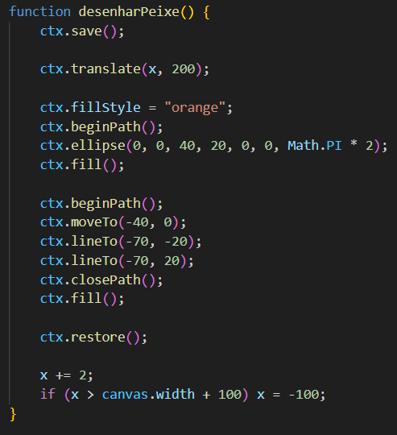
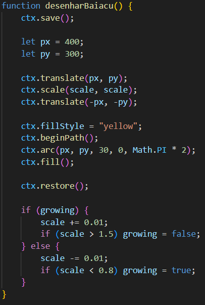
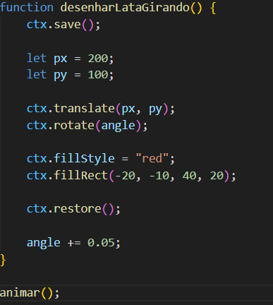
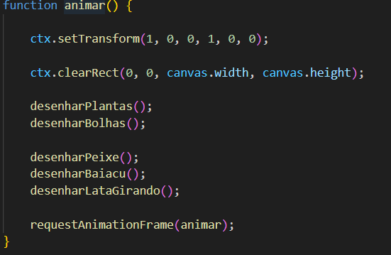
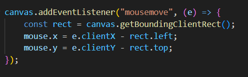
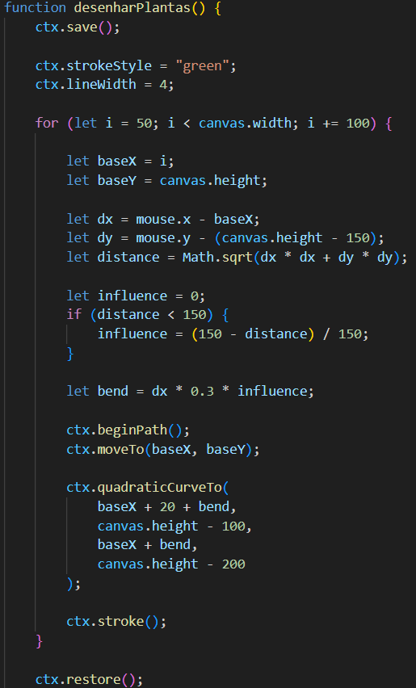

# Computação Gráfica - Oceano 2D

##  Grupo:
- Bruno Ferreira de Andrade Lyra
- Carlos Roberto Melo Damasceno Neto

##  Tema

A proposta do projeto foi a criação de uma cena interativa em 2D representando um **oceano**.

##  Tecnologias Utilizadas
- HTML
- JavaScript  
- Canvas 2D  

##  Elementos e Transformações

###  Peixe — Translação

O peixe se movimenta horizontalmente pela tela utilizando translação.

**Operação utilizada:**

ctx.translate(x, 200);

### Baiacu — Escala com Ponto Fixo (T → Op → T)
O baiacu simula o comportamento de inflar e desinflar utilizando escala em torno de um ponto fixo.

**Operação utilizada:**

ctx.translate(px, py); 
ctx.scale(scale, scale); 
ctx.translate(-px, -py);

### Lata de Refrigerante — Rotação + Translação
A lata realiza um movimento de rotação e translação.

**Operação utilizada:**
ctx.translate(px, py);
ctx.rotate(angle);

### Animação
A animação é feita utilizando requestAnimationFrame, garantindo fluidez e atualização contínua da cena.

### Gerenciamento de Estado
Foi utilizado save() e restore() para evitar interferência entre transformações:

### Requisito Bônus - Interatividade com mouse
Foi implementada interatividade onde as plantas reagem ao movimento do mouse, simulando o efeito de água sendo deslocada. Lógica: cálculo da distância entre o mouse e a planta e deformação da curva com base nessa distância

